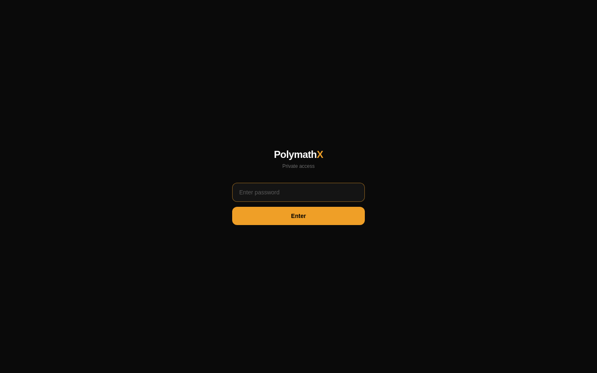

<div align="center">
  <h1>Polymath X 🧠✨</h1>

  **Xpand your perspective.**

  A focused web application where **Claude**, **GPT-4o**, and **Gemini** debate any topic you choose, featuring DeepSeek-powered moderation, document context injection, and structured summaries.

  [](https://nextjs.org/)
  [](https://www.typescriptlang.org/)
  [](https://www.convex.dev/)
  [](https://openrouter.ai/)
  [](https://tailwindcss.com/)
</div>

---

## 📖 Overview

**Polymath X** transforms the way you explore complex topics by orchestrating multi-model AI debates. Instead of relying on a single AI's perspective, Polymath X pits the world's leading foundation models (Claude, GPT-4o, and Gemini) against each other in structured, multi-round debates. 

Whether you are evaluating a business strategy, exploring a philosophical dilemma, or seeking diverse perspectives on an uploaded document, Polymath X provides a rigorous, moderated environment to challenge assumptions and surface nuanced insights.

## 📸 Screenshots

<div align="center">
  
  <p><em>The password-gated entry screen — clean, minimal, and dark. Access is private by design.</em></p>
</div>

---

## ✨ Key Features

- **Multi-Model Debates:** Watch Claude, GPT-4o, and Gemini stream their arguments in parallel.
- **Configurable Personas & Styles:** Tailor the debate style (e.g., Socratic, Devil's Advocate, Steel-man) and assign distinct personas to each model (e.g., Claude as an Ethicist, GPT-4o as a Pragmatist).
- **Document Context Injection:** Upload PDFs, Word documents, or images. The system extracts the text and injects it directly into the debate context, even auto-suggesting topics based on the content.
- **DeepSeek Moderation:** A dedicated moderator model guides the flow, asks follow-up questions in Round 2, and keeps the debate focused.
- **Black Hat Mode:** Enable a stress-test lens that introduces a fourth, highly contrarian debater (powered by `deepseek-reasoner`) to actively find flaws in the prevailing arguments.
- **Cross-Device History Sync:** Debate history is persisted seamlessly via Convex. Use a secure sync key to share your history across desktop and mobile devices.
- **AI Summaries & Judging:** Export-friendly markdown summaries and formal verdicts delivered by a dedicated judging model.

## 🛠️ Tech Stack

- **Framework:** [Next.js 14](https://nextjs.org/) (App Router)
- **UI & Styling:** React 18, Tailwind CSS, Lucide Icons
- **Backend & Database:** [Convex](https://www.convex.dev/) for real-time state and history persistence
- **AI Orchestration:** [OpenRouter](https://openrouter.ai/) (for Claude, Gemini, DeepSeek) and [OpenAI](https://openai.com/) (for native GPT-4o streaming)
- **Client-side Parsing:** `pdfjs-dist` and `mammoth` for local document extraction

## 🚀 Getting Started

### Prerequisites

- Node.js 18+ and npm
- A [Convex](https://dashboard.convex.dev/) account and project
- An [OpenRouter](https://openrouter.ai/) API key
- An [OpenAI](https://platform.openai.com/) API key

### Local Development

1. **Clone the repository:**
   ```bash
   git clone https://github.com/limchinhan123/polymathx.git
   cd polymathx
   ```

2. **Set up environment variables:**
   ```bash
   cp .env.example .env.local
   ```
   *Edit `.env.local` to include your OpenRouter key, OpenAI key, and Convex dev URL.*

3. **Install dependencies:**
   ```bash
   npm install
   ```

4. **Start the development environment:**
   You will need two terminal windows.
   
   *Terminal 1 (Sync Convex backend):*
   ```bash
   npx convex dev
   ```
   
   *Terminal 2 (Run Next.js app):*
   ```bash
   npm run dev
   ```
   Open [http://localhost:3000](http://localhost:3000) to start debating.

## 🔒 Security & Environment Variables

- **Server-Only Secrets:** `OPENROUTER_API_KEY` and `OPENAI_API_KEY` must never be exposed to the client. On Vercel, set these as Production Environment Variables.
- **Client Variables:** `NEXT_PUBLIC_CONVEX_URL` is exposed to the browser to connect to your database.
- **Access Gate:** You can set `NEXT_PUBLIC_ACCESS_PASSWORD` to place a simple password gate in front of the UI. *(Note: This deters casual UI traffic but does not secure the underlying API routes.)*

## 📚 Documentation & Architecture

For deeper technical details, contributors and operators should review the following internal documentation:
- [`AGENTS.md`](AGENTS.md): Architecture notes, state conventions, and learned preferences for AI contributors.
- [`docs/runbook.md`](docs/runbook.md): Human-facing operational steps, including deployment checklists and API key rotation procedures.
- [`docs/second-brain-polymath-x.md`](docs/second-brain-polymath-x.md): Project vision, timeline, and architectural decisions.

## 🤝 Contributing

Contributions are welcome! Please ensure you follow the existing code style, run `npm run lint` and `npm run typecheck` before submitting, and never commit `.env` files or hardcoded secrets.

## 📄 License

All rights reserved. This is a private project unless an explicit `LICENSE` file is added.

---
*Repo: [github.com/limchinhan123/polymathx](https://github.com/limchinhan123/polymathx)*
